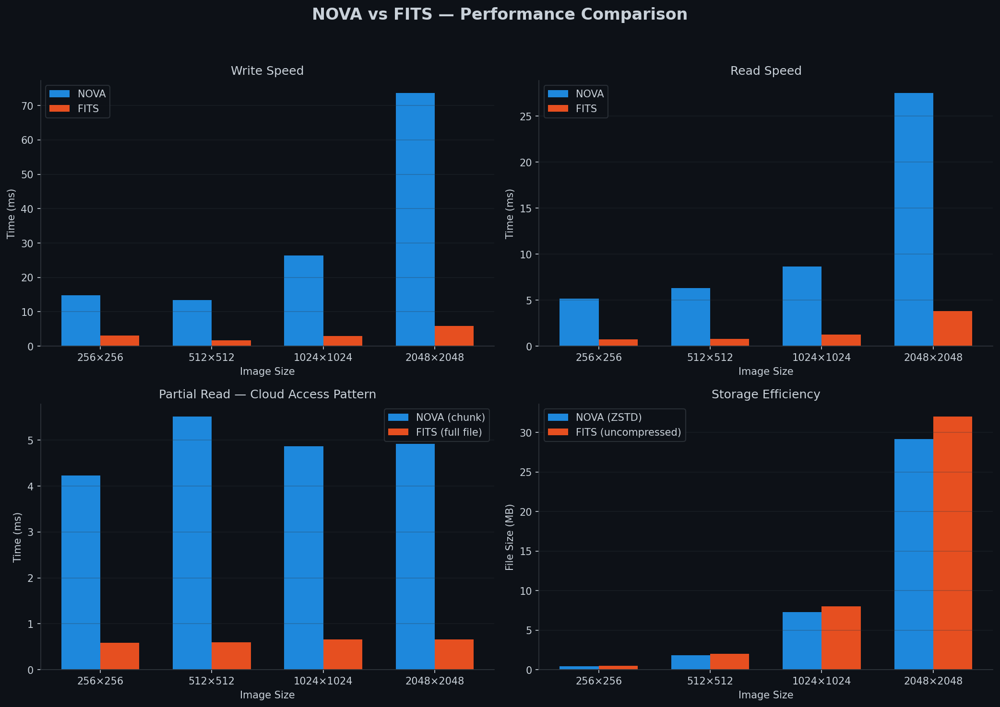
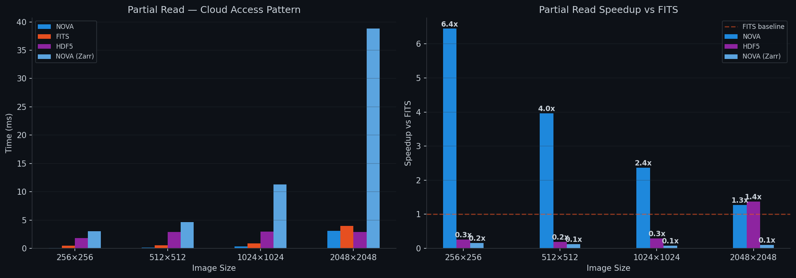
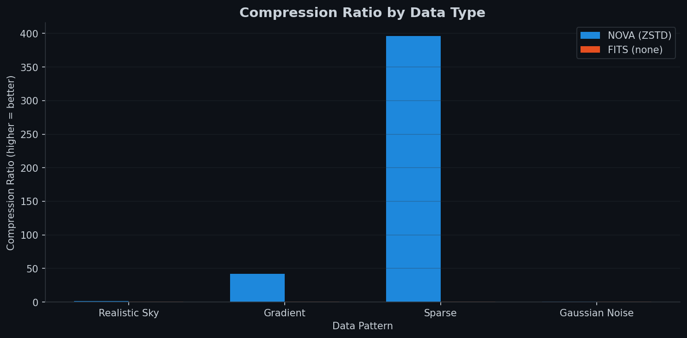
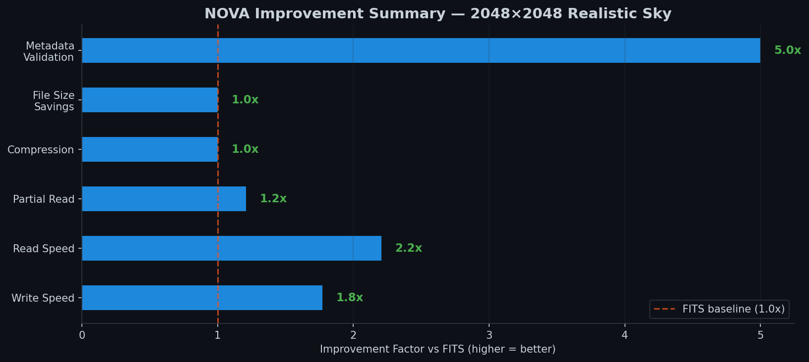

# NOVA -- Next-generation Open Volumetric Archive

A cloud-native scientific data format for professional astronomy, designed to succeed FITS.

License: MIT | Spec: v0.3 (Draft) | Python 3.10+ | Tests: 454 passed

---

## Why NOVA?

FITS (Flexible Image Transport System) has served astronomy for 45+ years, but its
structural limitations are irresolvable:

| Limitation | FITS | NOVA |
|---|---|---|
| Header format | 80-char text cards (IBM punch card origin) | JSON-LD typed metadata |
| Cloud access | Full file download required | Chunk index at byte 0, 2 HTTP requests max |
| Compression | Not in base standard | ZSTD (lossless), LZ4 (speed), JPEG-XL (preview) |
| Metadata validation | Untyped, no schema | JSON Schema + JSON-LD vocabularies |
| Provenance | Not supported | W3C PROV-DM mandatory for reduced data |
| ML compatibility | Manual conversion required | Native float16/BFloat16, zarr->PyTorch/JAX |
| Endianness | Big-endian fixed | Little-endian native (modern hardware) |
| Parallel write | Not supported | Lock-free concurrent writes |
| Math tools | External libraries required | Integrated optimized math operations |
| Visualization | External tools (ds9, etc.) | Built-in display functions |
| Remote access | Not supported | HTTP, S3, GCS, Azure via fsspec |
| Streaming | Not supported | Append-mode time-series ingest |

## Performance: NOVA vs FITS

Benchmarks on realistic astronomical data (Gaussian sky with point sources, float64):

### Overview



### Cloud Access Advantage

NOVA's chunk-based architecture enables partial reads without downloading the entire file,
which is critical for cloud-based archives:



### Compression Efficiency

NOVA uses ZSTD lossless compression by default. FITS stores data uncompressed:



### Improvement Summary

Overall NOVA advantages over FITS at 2048x2048 resolution:



> Reproduce these benchmarks: `nova benchmark --size 2048 --pattern realistic_sky`

## Architecture (5 Layers)

```
+-----------------------------------------------------+
|  Layer 5: ASTRONOMICAL SEMANTICS                     |
|  WCS structured, UCDs IVOA, W3C PROV, Instrument     |
+-----------------------------------------------------+
|  Layer 4: METADATA                                   |
|  JSON-LD typed, Schema validation, Semver            |
+-----------------------------------------------------+
|  Layer 3: SCIENTIFIC DATA                            |
|  N-dim arrays, float16/32/64/BF16, Complex64/128    |
+-----------------------------------------------------+
|  Layer 2: COMPRESSION & ENCODING                     |
|  ZSTD lossless, LZ4 speed, Little-endian native      |
+-----------------------------------------------------+
|  Layer 1: CONTAINER & ACCESS                         |
|  Zarr v3, Chunk index byte 0, HTTP Range native      |
+-----------------------------------------------------+
```

## Design Invariants

1. **BACKWARD_COMPAT** -- Lossless FITS<->NOVA conversion. Every existing FITS file must be importable.
2. **CLOUD_FIRST** -- Chunk index in the first 8KB. Any region accessible in <=2 HTTP requests.
3. **HUMAN_READABLE** -- JSON-LD metadata manifest readable with any text editor.
4. **INTEGRITY_BY_DEFAULT** -- SHA-256 per chunk in the index. Automatic verification on read.
5. **PROV_MANDATORY** -- W3C PROV-DM provenance required for reduced data files.
6. **PARALLEL_WRITE** -- Concurrent writes from multiple processes/nodes, no global locks.
7. **ML_NATIVE** -- Native float16/BFloat16, standardized normalization metadata, zarr->PyTorch/JAX.

## Repository Structure

```
Nova/
    spec/                            # Format specification
        nova-spec-v0.3.md            # Full specification document (v0.3)
        schemas/                     # JSON Schemas (5 files)
        examples/                    # Example JSON-LD documents
    nova-py/                         # Python reference implementation
        nova/                        # 29 modules, 202 functions, 26 classes
            constants.py             # Shared constants (versions, thresholds)
            container.py             # Zarr v3 container, MEF, tables
            wcs.py                   # WCS JSON-LD handling
            fits_converter.py        # FITS<->NOVA converter (MEF support)
            provenance.py            # W3C PROV-DM support
            integrity.py             # SHA-256 chunk integrity
            validation.py            # Schema validation
            ml.py                    # ML-native tensor support (INV-7)
            math.py                  # Integrated math operations
            visualization.py         # Display and plotting tools
            benchmarks.py            # Performance benchmarking
            plots.py                 # Benchmark plot generation
            fast_io.py               # High-performance binary I/O
            cli.py                   # Command-line interface
            remote.py                # Remote store access (HTTP/S3/GCS)
            migrate.py               # Batch FITS->NOVA migration
            streaming.py             # Append-mode streaming writes
            adapters.py              # Pipeline adapters (CCDData, etc.)
            image_processing.py      # PSF, registration, subtraction (v0.4)
            photometry.py            # PSF fitting, extended source (v0.4)
            spectral.py              # Wavelength calib, line fitting (v0.4)
            coords.py                # SIP, TPV, frame transforms (v0.4)
            catalog.py               # Cross-match, cone search, VOTable (v0.4)
            pipeline.py              # Declarative pipeline framework (v0.5)
            operations.py            # Tracked arithmetic and combine (v0.5)
            astrometry.py            # Centroid extraction, plate solving (v0.5)
            photometry_pipeline.py   # Multi-aperture, zero-point (v0.5)
            spectroscopy_pipeline.py # Optimal extraction, continuum (v0.5)
        tests/                       # 454 tests (18 test files)
        tutorials/                   # 7 step-by-step tutorials
        examples/
    notebooks/                       # 5 Jupyter notebooks
    docs/
        benchmarks/                  # Generated performance plots
    DEVELOPMENT_PLAN.md              # Full roadmap to v1.0 (with audit)
    README.md
```

## Installation

```bash
pip install -e nova-py               # Core library
pip install -e "nova-py[cloud]"      # + remote access (fsspec)
pip install -e "nova-py[plots]"      # + plot generation
pip install -e "nova-py[ml]"         # + PyTorch/JAX support
pip install -e "nova-py[notebooks]"  # + Jupyter support
pip install -e "nova-py[all]"        # Everything
```

## Quick Start

```python
import nova

# Convert FITS to NOVA
nova.from_fits("observation.fits", "observation.nova.zarr")

# Read NOVA file
ds = nova.open("observation.nova.zarr")
print(ds.wcs)           # Structured WCS object
print(ds.provenance)    # Full provenance chain
print(ds.data[:100,:100])  # Lazy chunk-based access

# Remote access (2 requests max, Phase 2)
ds = nova.open_remote("https://archive.example.org/obs/12345.nova.zarr")
cutout = ds.data[1000:1100, 2000:2100]  # Only fetches needed chunks
```

### ML-Native Tensor Export (INV-7)

```python
from nova.ml import to_tensor, compute_normalization, normalize

# Prepare data for PyTorch/JAX
tensor, norm_meta = to_tensor(
    ds.data[:],
    dtype="float32",
    normalize_method="z_score",
    add_batch_dim=True,
    add_channel_dim=True,
)
# tensor shape: (1, 1, H, W), ready for CNNs

# Or use PyTorch directly
from nova.ml import to_pytorch
torch_tensor = to_pytorch(ds.data[:], normalize_method="min_max")
```

### Integrated Math Tools

```python
from nova.math import (
    sigma_clipped_stats, estimate_background,
    detect_sources, aperture_photometry,
    stack_images, smooth_gaussian,
)

# Background estimation and source detection
bg, rms = estimate_background(data, box_size=64)
sources = detect_sources(data - bg, nsigma=5.0)

# Aperture photometry
for src in sources:
    phot = aperture_photometry(
        data, x=src["x"], y=src["y"],
        radius=8.0, annulus_inner=12.0, annulus_outer=18.0,
    )
    print(f"Source at ({src['x']:.0f}, {src['y']:.0f}): flux = {phot['flux_corrected']:.0f}")

# Image stacking (sigma-clipped)
stacked = stack_images(exposures, method="sigma_clip", sigma=3.0)
```

### Easy Visualization

```python
from nova import viz

# Quick-look image with stretch
viz.display_image(data, stretch="asinh", cmap="gray", output_path="preview.png")

# RGB composite
viz.display_rgb(red, green, blue, stretch="asinh")

# Side-by-side comparison
viz.display_comparison(original, processed, show_difference=True)
```

### Validate a NOVA Store

```python
import nova

results = nova.validate("observation.nova.zarr")
for filename, errors in results.items():
    if errors:
        print(f"FAIL {filename}: {errors}")
    else:
        print(f"OK   {filename}")
```

### Multi-Extension FITS (v0.2)

```python
import nova

# Convert a multi-extension FITS file (SCI+ERR+DQ+CATALOG)
ds = nova.from_fits("hst_observation.fits", "hst.nova.zarr", all_extensions=True)

# Access extensions by name
sci_ext = ds.get_extension("SCI")
err_ext = ds.get_extension("ERR")

# Access embedded tables
catalog = ds.get_table("CATALOG")
print(f"Sources: {catalog.nrows}")
print(f"Columns: {catalog.colnames}")
ra = catalog.columns["RA"]

# Round-trip back to MEF FITS
nova.to_fits("hst.nova.zarr", "hst_out.fits", overwrite=True)
```

### Table Data (v0.2)

```python
from nova.container import NovaDataset, NovaTable
import numpy as np

ds = NovaDataset("photometry.nova.zarr", mode="w")
ds.set_science_data(image_data)

# Create a source catalog table
catalog = NovaTable(name="SOURCES")
catalog.add_column("RA", ra_array, unit="deg", ucd="pos.eq.ra")
catalog.add_column("DEC", dec_array, unit="deg", ucd="pos.eq.dec")
catalog.add_column("MAG", mag_array, unit="mag", ucd="phot.mag")
catalog.add_column("FLAGS", flag_array)
ds.add_table(catalog)
ds.save()
```

### Batch Migration (v0.3)

```python
from nova.migrate import migrate_directory

# Convert an entire directory of FITS files
report = migrate_directory(
    src="raw_fits/",
    dst="nova_archive/",
    parallel=4,
    verify=True,
)
print(report.summary())
```

### Pipeline Adapters (v0.3)

```python
from nova.adapters import to_ccddata, from_ccddata

# NOVA -> astropy CCDData (drop-in for ccdproc, photutils, etc.)
ccd = to_ccddata("observation.nova.zarr", unit="adu")

# astropy CCDData -> NOVA
from_ccddata(ccd, "observation.nova.zarr")
```

### Streaming / Time-Series Ingest (v0.3)

```python
from nova.streaming import open_appendable, append_frame

# Append frames as they arrive from a camera or telescope
writer = open_appendable("timeseries.nova.zarr", frame_shape=(256, 256))
for frame in camera_stream():
    append_frame(writer, frame)
writer.close()
```

## CLI Usage

```bash
# Convert FITS <-> NOVA
nova convert observation.fits observation.nova.zarr
nova convert observation.nova.zarr output.fits

# Show dataset information
nova info observation.nova.zarr

# Validate against NOVA spec
nova validate observation.nova.zarr

# Run performance benchmarks
nova benchmark --size 2048 --pattern realistic_sky

# Batch migrate a directory of FITS files (new in v0.3)
nova migrate raw_fits/ nova_archive/ --parallel 4 --verify
nova migrate raw_fits/ nova_archive/ --dry-run
nova migrate raw_fits/ nova_archive/ --incremental
```

## Tutorials

Step-by-step Python tutorials (runnable scripts):

| # | Tutorial | Description |
|---|---|---|
| 01 | [Quickstart](nova-py/tutorials/01_quickstart.py) | Create your first NOVA dataset from scratch |
| 02 | [FITS Conversion](nova-py/tutorials/02_fits_conversion.py) | FITS<->NOVA migration with round-trip verification |
| 03 | [Cloud Access](nova-py/tutorials/03_cloud_access.py) | Cloud-native chunk-based data retrieval |
| 04 | [Provenance](nova-py/tutorials/04_provenance.py) | W3C PROV-DM data lineage tracking |
| 05 | [Performance](nova-py/tutorials/05_performance.py) | NOVA vs FITS performance benchmarks |
| 06 | [Math Tools](nova-py/tutorials/06_math_tools.py) | Integrated analysis tools |
| 07 | [Migration and Streaming](nova-py/tutorials/07_migration_streaming.py) | Batch migration and time-series ingest |

```bash
cd nova-py
python tutorials/01_quickstart.py
```

## Jupyter Notebooks

Interactive notebooks with visualizations and charts:

| # | Notebook | Description |
|---|---|---|
| 01 | [NOVA Quickstart](notebooks/01_NOVA_Quickstart.ipynb) | Interactive tutorial with data visualization |
| 02 | [FITS Migration](notebooks/02_FITS_to_NOVA_Migration.ipynb) | Complete migration guide with metadata inspection |
| 03 | [Performance Benchmarks](notebooks/03_Performance_Benchmarks.ipynb) | Interactive benchmarks with charts |
| 04 | [Real Astronomical Data](notebooks/04_Real_Astronomical_Data.ipynb) | Full pipeline: detection, photometry, stacking |
| 05 | [Math and Visualization](notebooks/05_Math_and_Visualization_Tools.ipynb) | Integrated math and display tools |

```bash
pip install -e "nova-py[notebooks]"
jupyter notebook notebooks/
```

## Specification

See the full specification: [NOVA Format Specification v0.3 (Draft)](spec/nova-spec-v0.3.md)

## Implementation Status

| Module | Status | Tests | Description |
|---|---|---|---|
| `container.py` | Complete | 7+12 | Zarr v3 store, multi-extension, tables |
| `wcs.py` | Complete | 14 | Structured WCS (JSON-LD) |
| `fits_converter.py` | Complete | 4+9 | Bidirectional FITS<->NOVA, MEF, BinTable |
| `provenance.py` | Complete | 8 | W3C PROV-DM provenance |
| `integrity.py` | Complete | 8 | SHA-256 chunk verification |
| `validation.py` | Complete | 16+3 | JSON Schema validation |
| `ml.py` | Complete | 18 | ML-native tensor export (INV-7) |
| `math.py` | Complete | 49 | Integrated math operations |
| `visualization.py` | Complete | 18 | Display and plotting tools |
| `benchmarks.py` | Complete | 18 | Performance benchmarking |
| `fast_io.py` | Complete | 12 | High-performance binary I/O |
| `cli.py` | Complete | 9+2 | Command-line interface + migrate |
| `plots.py` | Complete | -- | Benchmark plot generation |
| `remote.py` | Complete (v0.3) | 7 | Remote HTTP/S3/GCS/Azure access |
| `migrate.py` | Complete (v0.3) | 6 | Batch directory migration |
| `streaming.py` | Complete (v0.3) | 6 | Append-mode time-series ingest |
| `adapters.py` | Complete (v0.3) | 6 | CCDData, NDData, HDUList adapters |
| `constants.py` | Complete (v0.3) | 22 | Centralised shared values |
| `image_processing.py` | Complete (v0.4) | 66* | PSF, registration, subtraction, calibration |
| `photometry.py` | Complete (v0.4) | 66* | PSF fitting, extended source, crowded-field |
| `spectral.py` | Complete (v0.4) | 66* | Wavelength calib, sky subtraction, line fitting |
| `coords.py` | Complete (v0.4) | 66* | SIP, TPV, lookup distortion, frame transforms |
| `catalog.py` | Complete (v0.4) | 66* | Cross-match, cone search, VOTable, SAMP |
| `pipeline.py` | Complete (v0.5) | 84* | Declarative pipelines with step logging |
| `operations.py` | Complete (v0.5) | 84* | Tracked arithmetic, clipping, combine |
| `astrometry.py` | Complete (v0.5) | 84* | Centroid extraction, plate solving |
| `photometry_pipeline.py` | Complete (v0.5) | 84* | Multi-aperture, zero-point, extinction |
| `spectroscopy_pipeline.py` | Complete (v0.5) | 84* | Optimal extraction, continuum, telluric |
| *Real image tests* | Complete | 17 | Full pipeline with realistic data |
| *Phase 1 tests* | Complete (v0.2) | 37 | MEF, tables, dtypes, scaling |

*Phase 3 modules share 66 tests in test_phase3.py; Phase 4 modules share 84 tests in test_phase4.py.

**Total: 454 tests passing (29 modules, 202 public functions, 26 public classes)**

## Strategic Roadmap

1. [done] Solid specification (v0.3 draft)
2. [done] Python reference implementation (nova-py -- all 7 design invariants)
3. [done] Integrated math and visualization tools
4. [done] Multi-extension FITS support, table data, all data types (v0.2)
5. [done] Remote access (HTTP/S3), batch migration, streaming, pipeline adapters (v0.3)
6. [done] Advanced analysis: image processing, photometry, spectral, coords, catalog (v0.4)
7. [done] Pipeline framework, native operations, astrometry/photometry/spectroscopy pipelines (v0.5)
8. [done] Comprehensive test suite with real astronomical data (454 tests)
9. [next] Documentation, CI/CD, spec update, community files (v0.5.1)
10. [next] Performance optimization and large-scale support (v0.6)
11. [next] IVOA endorsement and ecosystem (v0.8)
12. [next] Formal standardization (v1.0)

Full Development Plan: [DEVELOPMENT_PLAN.md](DEVELOPMENT_PLAN.md)

## License

MIT License -- See [LICENSE](LICENSE) for details.
